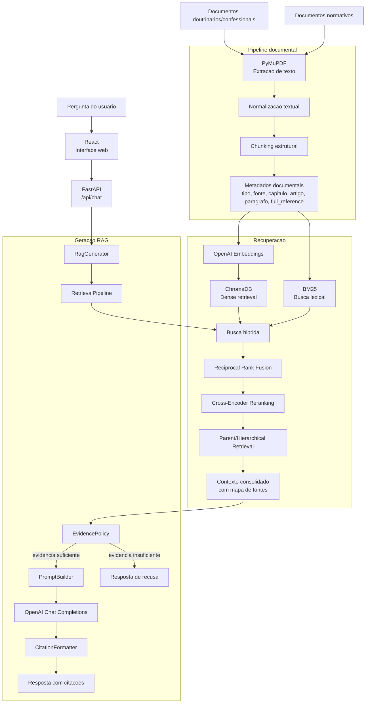

# SolaBot

## Sobre o Projeto

SolaBot e um assistente conversacional baseado em RAG para consulta a documentos doutrinarios/confessionais e documentos normativos denominacionais. A proposta nao e criar um chatbot generico apoiado apenas no conhecimento previo do modelo, mas um sistema fundamentado em corpus controlado, com recuperacao rastreavel, citacoes documentais e recusa quando nao houver evidencia suficiente.

O escopo atual combina confissoes e catecismos ja processados com um corpus normativo composto por Constituicao, Regimento Interno, Codigo de Etica do Ministro Congregacional, Resolucao nº 01/2020 e Confissao de Fe Congregacional.

## Objetivo

Desenvolver e avaliar um assistente documental capaz de responder perguntas doutrinarias e normativas a partir dos documentos processados, mantendo fidelidade documental, rastreabilidade das fontes, controle de corpus ativo e separacao entre ensino doutrinario, norma institucional, procedimento administrativo e orientacao etica.

## Escopo Atual

O projeto possui quatro camadas principais:

1. Pipeline documental para extracao, normalizacao, chunking estrutural, metadados e auditoria.
2. Pipeline de embeddings e recuperacao com ChromaDB, BM25, busca hibrida, RRF, reranking e recuperacao hierarquica.
3. Geracao RAG com politica de evidencia, PromptBuilder, CitationFormatter e chamada ao modelo.
4. Interface local com API FastAPI e frontend React.

O corpus ativo consolidado usa o id `alliance_documents`. Os chunks unificados ficam em `corpus/processed/chunks/alliance/all_chunks_for_embeddings.jsonl` e a collection ChromaDB usada pelo retrieval e `solabot_alliance_v1`.

Upload livre de documentos pelo usuario final nao faz parte do escopo atual.

## Perguntas Suportadas

Exemplos de perguntas que o sistema deve tratar:

- "Do que se trata a justificação?"
- "O que é ser regenerado?"
- "O que é a perseverança dos santos?"
- "O que a Aliança entende por igreja filiada?"
- "Quais os deveres da igreja local?"
- "Como funciona o processo de ordenação de ministros?"
- "Quais são os deveres éticos de um pastor?"
- "Quais os critérios para emancipação de campos missionários?"

Perguntas normativas devem ser sustentadas por documentos normativos. Perguntas doutrinarias devem ser sustentadas por documentos doutrinarios/confessionais. Perguntas mistas podem combinar ambos quando os trechos recuperados sustentarem a resposta.

## Corpus Atual

Documentos doutrinarios/confessionais:

- Confissao de Fe de Westminster;
- Canones de Dort;
- Catecismo de Heidelberg;
- Confissao Batista de Londres de 1689;
- Confissao de Fe Congregacional.

Documentos normativos:

- Constituicao da Alianca;
- Regimento Interno;
- Codigo de Etica do Ministro Congregacional;
- Resolucao nº 01/2020.

Artefatos principais:

- Chunks reformados: `corpus/processed/chunks/reformed/`
- Chunks normativos: `corpus/processed/chunks/normative/`
- Chunks unificados para embeddings: `corpus/processed/chunks/alliance/all_chunks_for_embeddings.jsonl`
- Manifesto de embeddings: `corpus/processed/embeddings/alliance/embedding_manifest.json`
- Indice ChromaDB local: `corpus/indexes/chroma/alliance/`
- Relatorios tecnicos: `corpus/reports/`
- Especificacoes de etapa: `reports/specs/` e `specs/`

Os arquivos `openai_embeddings.jsonl`, `corpus/indexes/chroma/`, `web/dist/`, `node_modules/` e `runtime_logs/` sao artefatos locais gerados e nao devem ser versionados.

## Arquitetura Geral



## Fluxo RAG

1. Os documentos controlados sao extraidos com PyMuPDF.
2. O texto passa por normalizacao e chunking estrutural.
3. Cada chunk recebe metadados como `doc_id`, `document_title`, `document_type`, `source_category`, `chapter_title`, `section_title`, `article_number`, `paragraph_number`, `inciso`, `alinea`, `full_reference`, `biblical_references`, paginas e `retrieval_namespace`.
4. Os chunks elegiveis geram embeddings OpenAI e alimentam uma collection ChromaDB.
5. O BM25 e inicializado a partir dos chunks processados para preservar termos exatos.
6. O `RetrievalPipeline` combina busca vetorial e BM25, aplica RRF, reranking e expansao hierarquica.
7. O contexto consolidado e avaliado pela `EvidencePolicy`.
8. Se houver evidencia suficiente, o `PromptBuilder` monta o prompt final e o modelo responde com fontes formatadas pelo `CitationFormatter`.
9. Se a evidencia for insuficiente ou incompatível com o tipo de pergunta, o sistema recusa educadamente.

## Politica de Evidencia

A `EvidencePolicy` considera a natureza da pergunta:

- Perguntas doutrinarias exigem contexto doutrinario/confessional.
- Perguntas normativas exigem contexto normativo.
- Perguntas mistas podem combinar os dois tipos de fonte.
- Perguntas genericas procuram evidencias no maior numero possivel de documentos recuperados, sem preferencia automatica por fonte normativa ou doutrinaria.

O sistema nao deve inventar artigos, incisos, capitulos, regras, doutrinas ou conclusoes que nao estejam sustentadas pelo contexto recuperado.

## Stack Tecnologica

| Componente | Tecnologia | Finalidade |
| --- | --- | --- |
| Interface | React + Vite | Interface web local |
| API | FastAPI | Endpoints de chat, documentos, sugestoes e healthcheck |
| Linguagem principal | Python | Pipeline documental, retrieval e geracao |
| Extracao de PDF | PyMuPDF | Extracao textual dos documentos |
| Banco vetorial | ChromaDB | Armazenamento e busca por embeddings |
| Embeddings | OpenAI API | Vetorizacao de chunks e perguntas |
| Busca lexical | rank-bm25 | Recuperacao por termos exatos |
| Reranking | sentence-transformers | Cross-Encoder reranking |
| Geracao | OpenAI API | Resposta final baseada no contexto |
| Configuracao | python-dotenv | Variaveis de ambiente |
| Testes | pytest | Verificacoes automatizadas |
| Qualidade | ruff | Lint e padronizacao |

## Estrutura do Projeto

```txt
sola-bot/
├── config/
├── corpus/
│   ├── raw/
│   ├── processed/
│   ├── indexes/
│   └── reports/
├── reports/
├── scripts/
│   └── pipeline/
├── src/
│   └── sola_bot/
│       ├── api/
│       ├── generation/
│       └── retrieval/
├── tests/
└── web/
```

## Instalacao

Instale as dependencias Python:

```bash
pip install -r requirements.txt
```

Instale as dependencias do frontend apenas se for rodar o Vite em modo desenvolvimento:

```bash
cd web
npm install
```

## Configuracao de Ambiente

Copie `.env.example` para `.env` e configure:

```bash
OPENAI_API_KEY=your_openai_api_key_here
RAG_CORPUS_DIR=corpus
RAG_CHUNKS_PATH=corpus/processed/chunks/alliance/all_chunks_for_embeddings.jsonl
CHROMA_PERSIST_DIRECTORY=corpus/indexes/chroma/alliance
CHROMA_COLLECTION_NAME=solabot_alliance_v1
LANGSMITH_TRACING=false
LANGSMITH_API_KEY=your_langsmith_api_key_here
LANGSMITH_PROJECT=solabot-local
```

Nao versionar chaves reais nem arquivos `.env`.

## Integracao com LangSmith

A integracao com LangSmith e opcional e fica desligada por padrao em `.env.example`.
Quando `LANGSMITH_TRACING=true`, o backend envia traces do fluxo RAG para o projeto configurado.

No site do LangSmith:

1. Acesse `https://smith.langchain.com`.
2. Crie ou selecione um workspace.
3. Crie um `Personal Access Token (PAT)` em `Settings` > `API Keys` para uso local. Use `Service key` apenas se a aplicacao for publicada como servico/ambiente de producao.
4. Crie ou selecione um projeto em `Projects`; o nome deve bater com `LANGSMITH_PROJECT`.
5. Copie a API key para o `.env` local.

No `.env` local:

```bash
LANGSMITH_TRACING=true
LANGSMITH_API_KEY=lsv2_sua_chave_aqui
LANGSMITH_PROJECT=solabot-local
```

Se o workspace estiver em uma regiao diferente da padrao dos EUA, configure tambem o endpoint informado pelo LangSmith:

```bash
LANGSMITH_ENDPOINT=https://eu.api.smith.langchain.com
```

Depois, reinicie a aplicacao:

```bash
python scripts/run_web_chat.py
```

Ao enviar uma pergunta pela interface, o projeto no LangSmith deve mostrar um trace pai `SolaBot RAG answer` com spans de recuperacao, politica de evidencia, montagem do prompt e chamada OpenAI. Chamadas de sugestoes aparecem como `SolaBot suggested questions`.

Na tela de quickstart do LangSmith, nao use o exemplo `Claude Agent SDK` nem configure `ANTHROPIC_API_KEY`, porque esta aplicacao usa OpenAI. Para este projeto, basta configurar as variaveis acima no `.env`, instalar `requirements.txt` e rodar a aplicacao. Se quiser comparar com um exemplo do site, selecione a aba `OpenAI`.

## Como Reprocessar o Corpus

Corpus reformado ja existente:

```bash
python scripts/pipeline/extract_reformed_corpus.py
python scripts/pipeline/normalize_reformed_corpus.py
python scripts/pipeline/chunk_reformed_corpus.py
```

Corpus normativo:

```bash
python scripts/pipeline/extract_normative_corpus.py
python scripts/pipeline/normalize_normative_corpus.py
python scripts/pipeline/chunk_normative_corpus.py
python scripts/pipeline/audit_normative_corpus.py
```

Embeddings e indice vetorial:

```bash
python scripts/pipeline/generate_openai_embeddings.py --resume
python scripts/pipeline/build_reformed_chroma_index.py --reset
```

## Como Rodar a Aplicacao

Modo principal, com FastAPI servindo API e frontend buildado:

```bash
python scripts/run_web_chat.py
```

URL principal:

```txt
http://127.0.0.1:8000
```

Modo de desenvolvimento do frontend:

```bash
python scripts/run_web_chat.py
cd web
npm run dev
```

Nesse modo:

- `http://127.0.0.1:8000` e a API FastAPI.
- `http://127.0.0.1:5173` e o servidor Vite para desenvolvimento visual.
- O Vite encaminha chamadas `/api/*` para `http://127.0.0.1:8000`.

Nao ha necessidade de usar a porta `7173`.

## Docker

Docker nao e obrigatorio para desenvolver localmente. O caminho mais simples continua sendo:

```bash
python scripts/run_web_chat.py
```

Use Docker quando quiser empacotar backend e frontend buildado em um ambiente reproduzivel. Localmente, o Compose monta `./corpus` como volume. No Render Free, os dados do RAG entram na imagem pelo arquivo `runtime_artifacts/solabot-runtime-corpus.tar.gz`.

Antes de rodar o container, confirme que os artefatos de runtime existem localmente:

- `corpus/processed/chunks/alliance/all_chunks_for_embeddings.jsonl`
- `corpus/indexes/chroma/alliance/`

Com Compose:

```bash
docker compose up --build
```

O Compose monta `./corpus` em `/app/storage/corpus` dentro do container para facilitar teste local.

Execucao direta equivalente:

```bash
docker build -t solabot .
docker run --rm -p 8000:8000 --env-file .env -e RAG_CORPUS_DIR=/app/storage/corpus -e CHROMA_PERSIST_DIRECTORY=/app/storage/corpus/indexes/chroma/alliance -e RAG_CHUNKS_PATH=/app/storage/corpus/processed/chunks/alliance/all_chunks_for_embeddings.jsonl -v "%cd%/corpus:/app/storage/corpus" solabot
```

A aplicacao ficara em:

```txt
http://127.0.0.1:8000
```

## Deploy Gratis no Render

No Render Free, nao ha disco persistente. Por isso, o pacote de dados RAG precisa ser versionado e copiado para dentro da imagem Docker.

Arquitetura:

```txt
GitHub/Docker image: codigo, frontend buildado, dependencias e runtime_artifacts/solabot-runtime-corpus.tar.gz
Container em runtime: extrai o pacote para /app/corpus durante o build da imagem
```

Antes do deploy, gere ou atualize o pacote de dados:

```bash
python scripts/deployment/create_runtime_corpus_archive.py
```

O arquivo gerado deve existir e ser commitado:

```txt
runtime_artifacts/solabot-runtime-corpus.tar.gz
```

O arquivo `render.yaml` declara um Web Service Docker gratuito. No Render, configure as variaveis sensiveis no painel:

```bash
OPENAI_API_KEY=...
LANGSMITH_API_KEY=...
```

As variaveis de dados ficam assim:

```bash
RAG_CORPUS_DIR=/app/corpus
RAG_CHUNKS_PATH=/app/corpus/processed/chunks/alliance/all_chunks_for_embeddings.jsonl
CHROMA_PERSIST_DIRECTORY=/app/corpus/indexes/chroma/alliance
CHROMA_COLLECTION_NAME=solabot_alliance_v1
```

Passos no Render:

1. Clique em `New` > `Blueprint`.
2. Selecione o repositorio.
3. Use a branch com este commit.
4. Use `render.yaml` como Blueprint Path.
5. Preencha `OPENAI_API_KEY`.
6. Crie o servico.

Observacoes do Render Free: o servico pode dormir apos inatividade, a primeira resposta depois de acordar pode demorar e arquivos criados em runtime podem ser perdidos em reinicios. Como o corpus esta dentro da imagem, ele volta a existir a cada deploy/restart.

Para caber melhor no plano gratuito, o reranker continua ativo, mas com carga reduzida:

```bash
RERANKER_ENABLED=true
RERANKER_MODEL=cross-encoder/mmarco-mMiniLMv2-L12-H384-v1
RERANKED_TOP_K=12
HYBRID_CANDIDATE_K=16
RERANKER_MAX_TEXT_CHARS=1800
```

Isso preserva a etapa metodologica de reranking sem tentar reordenar dezenas de textos longos em uma instancia pequena. O Dockerfile baixa o modelo do reranker durante o build para evitar que a primeira pergunta do usuario tente baixar o modelo em runtime.

## Endpoints Principais

- `GET /api/health`
- `GET /api/documents`
- `POST /api/chat`
- `POST /api/suggestions`

## Verificacoes Uteis

```bash
python -m pytest tests/test_normative_corpus_pipeline.py
python -m pytest tests/test_openai_embeddings.py
python -m pytest tests/test_chroma_vector_index.py
python -m pytest tests/test_vector_retriever.py
python -m pytest tests/test_hybrid_retriever.py
python -m pytest tests/test_reranker_retriever.py
python -m pytest tests/test_hierarchical_retriever.py
python -m pytest tests/test_retrieval_pipeline.py
python -m pytest tests/test_rag_answer_generation.py
python -m pytest tests/test_alliance_rag_integration.py
```

Perguntas minimas de verificacao:

- "Do que se trata a justificação?"
- "O que é ser regenerado?"
- "O que a Confissão de Fé Congregacional ensina sobre justificação?"
- "Quais documentos uma igreja precisa apresentar para se filiar?"
- "Quais os deveres da igreja local?"
- "Como funciona o processo de ordenação de ministros?"
- "Quais são os deveres éticos do pastor?"
- "Quais os critérios para emancipação de campos missionários?"

## Observacoes de Versionamento

Nao commitar:

- `.env`
- `node_modules/`
- `web/node_modules/`
- `web/dist/`
- `runtime_logs/`
- `corpus/indexes/chroma/`
- `corpus/processed/embeddings/**/openai_embeddings.jsonl`

Esses arquivos sao gerados localmente e podem ser reconstruidos pelos scripts do projeto.
