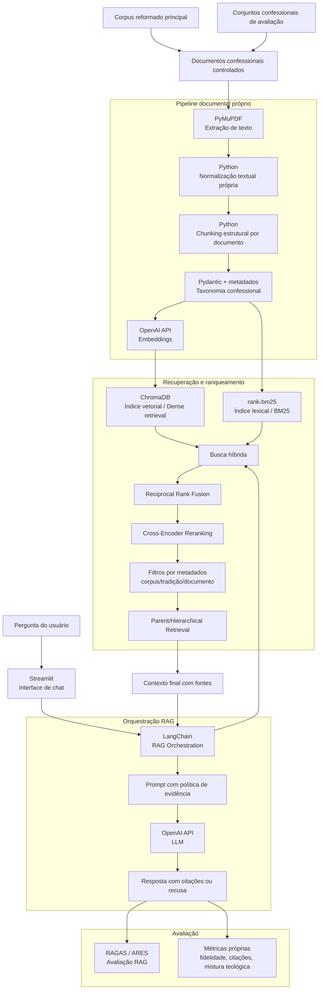

# SolaBot

## Sobre o Projeto

SolaBot é um projeto de agente conversacional baseado em arquitetura RAG para consulta doutrinária cristã a partir de documentos confessionais. A proposta não é criar um chatbot genérico apoiado apenas no conhecimento prévio de um modelo de linguagem, mas um sistema fundamentado em um corpus documental controlado.

O foco inicial será uma instância especializada na tradição reformada. A arquitetura, porém, será organizada para permitir a inclusão de outros conjuntos documentais confessionais em cenários controlados de avaliação.

## Objetivo

Desenvolver e avaliar um agente conversacional capaz de responder perguntas doutrinárias com base em confissões de fé, catecismos e declarações confessionais, mantendo fidelidade documental, rastreabilidade das fontes e controle explícito do corpus ativo.

## Escopo Atual

Nesta fase, o corpus será controlado, preparado e processado pela desenvolvedora/pesquisadora. O pipeline documental próprio do projeto será responsável por extração, normalização, chunking estrutural, metadados, auditoria e avaliação.

No início do desenvolvimento, o corpus principal conterá apenas documentos reformados. Nesse cenário inicial, não há risco real de mistura entre tradições, pois o corpus ativo será reformado. O risco de mistura teológica será avaliado posteriormente, quando outros conjuntos documentais confessionais forem adicionados em cenários controlados de avaliação.

Upload livre de documentos pelo usuário final não faz parte do escopo principal atual e poderá ser considerado como trabalho futuro.

## O que o SolaBot vai fazer

O SolaBot deverá receber perguntas como:

- "O que é o batismo?"
- "O que é necessário para a salvação?"
- "O divórcio é permitido?"

As respostas deverão ser construídas a partir dos documentos disponíveis no corpus ativo, com indicação das fontes utilizadas. Na instância inicial, isso significa responder a partir do corpus reformado. Durante a avaliação, o sistema será exposto a conjuntos confessionais de outras tradições para testar se respeita o corpus ativo, preserva rastreabilidade e evita mistura teológica indevida.

## Arquitetura Geral



## Fluxo RAG

1. Os documentos confessionais controlados são extraídos com PyMuPDF.
2. O texto passa por normalização e chunking estrutural por módulos próprios do projeto.
3. Cada chunk recebe metadados de corpus, tradição, documento, seção, páginas e namespace de recuperação.
4. Os chunks alimentam um índice vetorial para dense retrieval e um índice lexical BM25.
5. A pergunta do usuário é recebida pela interface Streamlit.
6. LangChain orquestra a cadeia RAG, conectando retriever, prompt, contexto recuperado e LLM.
7. A recuperação combina busca vetorial e lexical, aplica RRF, reranking, filtros por metadados e recuperação hierárquica.
8. O prompt RAG usa uma política de evidência para responder com citações ou recusar quando não houver base documental suficiente.

## Fundamentação Teórica e Estratégia Algorítmica

O SolaBot será estruturado como uma arquitetura RAG modular para um domínio sensível, no qual respostas doutrinárias precisam ser fundamentadas em documentos confessionais, com rastreabilidade das fontes, controle de corpus ativo e avaliação do risco de mistura teológica.

A técnica central será Retrieval-Augmented Generation. O modelo de linguagem não deverá responder apenas com base em seu conhecimento paramétrico, mas a partir de trechos recuperados do corpus documental ativo.

O chunking deverá ser estrutural, respeitando a organização interna dos documentos confessionais. A Confissão de Fé de Westminster e a Confissão Batista de Londres de 1689 serão divididas considerando capítulos, seções e parágrafos; os Cânones de Dort, por capítulos doutrinários, artigos e rejeições de erro; o Catecismo de Heidelberg, por perguntas e respostas.

A recuperação deverá combinar dense retrieval por embeddings e BM25. A busca vetorial captura proximidade semântica, enquanto a busca lexical preserva termos teológicos técnicos como eleição, reprovação, justificação, regeneração, expiação, aliança, batismo e perseverança dos santos.

A estratégia principal de recuperação será híbrida, com fusão de rankings por Reciprocal Rank Fusion. Após a recuperação inicial, a arquitetura deverá prever Cross-Encoder Reranking para reordenar candidatos a partir do par pergunta + chunk.

Os chunks deverão conter metadados como `corpus_id`, `tradition`, `document_id`, `section_title`, `page_start`, `page_end`, `source_path` e `retrieval_namespace`. O retriever deverá aplicar filtros por corpus ativo, tradição e documento para controlar o escopo confessional da resposta.

A arquitetura também deverá prever Parent Document Retrieval, usando chunks menores para busca e trechos maiores ou hierárquicos para envio ao LLM. Isso é importante porque documentos confessionais dependem de contexto interno, como capítulo, artigo, seção ou pergunta.

O sistema deverá aplicar recusa baseada em evidência: quando os trechos recuperados não sustentarem uma resposta, o chatbot deverá informar que não encontrou base documental suficiente no corpus ativo, em vez de inventar uma resposta.

A avaliação será inspirada em métricas de sistemas RAG, como fidelidade ao contexto, relevância da resposta, precisão do contexto e recuperação correta dos trechos relevantes. Além disso, serão definidas métricas próprias para consulta doutrinária, incluindo fidelidade documental, acurácia das citações, taxa de mistura teológica, taxa de resposta sem evidência, taxa de recusa correta, qualidade dos chunks e separação entre corpus reformado e conjuntos confessionais de avaliação.

## Corpus Inicial

O corpus principal será reformado e controlado pela desenvolvedora/pesquisadora. A fase inicial prevê os seguintes documentos:

- Confissão de Fé de Westminster;
- Cânones de Dort;
- Catecismo de Heidelberg;
- Confissão Batista de Londres de 1689.

Outros conjuntos documentais confessionais serão adicionados durante a avaliação, em cenários controlados, para testar fidelidade documental, separação entre corpus, risco de mistura teológica e comportamento do sistema quando exposto a documentos de tradições diferentes da tradição reformada.

## Stack Tecnológica

| Componente | Tecnologia | Finalidade |
| --- | --- | --- |
| Interface | Streamlit | Interface web do chatbot |
| Linguagem principal | Python | Lógica central da aplicação e scripts do pipeline |
| Pipeline documental | Scripts próprios do SolaBot | Extração, normalização, chunking estrutural, metadados, auditoria e avaliação |
| Extração de PDF | PyMuPDF | Extração textual dos documentos confessionais |
| Validação de dados | pydantic | Modelos de dados, metadados e validação |
| Orquestração RAG | LangChain | Integração entre retriever, prompt, contexto e LLM |
| Banco vetorial | ChromaDB | Armazenamento e recuperação de embeddings dos chunks |
| Embeddings | OpenAI API | Vetorização de perguntas e chunks documentais |
| Busca lexical | rank-bm25 | Recuperação por termos doutrinários exatos |
| Provedor de LLM | OpenAI API | Geração de respostas com base no contexto recuperado |
| Avaliação RAG | RAGAS / ARES | Apoio à avaliação de fidelidade, relevância e contexto |
| Dados de avaliação | datasets | Organização de conjuntos de perguntas e respostas esperadas |
| Métricas e análise | scikit-learn / numpy | Cálculo de métricas e análise quantitativa |
| Configuração | python-dotenv | Carregamento de variáveis de ambiente |
| Testes | pytest | Testes automatizados |
| Qualidade de código | ruff | Lint e padronização |

## Estrutura do Projeto

```txt
sola-bot/
├── README.md
├── requirements.txt
├── .env.example
├── .gitignore
├── docs/
├── config/
├── corpus/
├── reports/
├── scripts/
├── src/
│   └── sola_bot/
└── tests/
```

## Instalação

Crie um ambiente virtual em uma etapa futura do desenvolvimento e instale as dependências:

```bash
pip install -r requirements.txt
```

## Configuração de Ambiente

Copie o arquivo `.env.example` para `.env` e preencha as variáveis necessárias:

```bash
OPENAI_API_KEY=your_openai_api_key_here
CHROMA_PERSIST_DIRECTORY=corpus/indexes/chroma
ACTIVE_CORPUS=reformed
```

Não versionar chaves de API reais.

## Como Executar

Os comandos abaixo representam a intenção inicial do projeto. A lógica completa ainda será implementada:

```bash
python scripts/ingest_corpus.py
python scripts/build_vector_index.py
streamlit run src/sola_bot/app/streamlit_app.py
python scripts/evaluate_rag.py
```

## Roadmap

- Criar pipeline próprio de ingestão documental;
- Implementar extração de PDFs com PyMuPDF;
- Implementar normalização textual;
- Implementar chunking estrutural com metadados auditáveis;
- Criar índices vetorial e lexical;
- Implementar retrieval híbrido com RRF, reranking e filtros de metadados;
- Integrar geração de respostas com modelo de linguagem;
- Criar avaliação com perguntas de teste e métricas;
- Executar cenários controlados com documentos confessionais de outras tradições.
