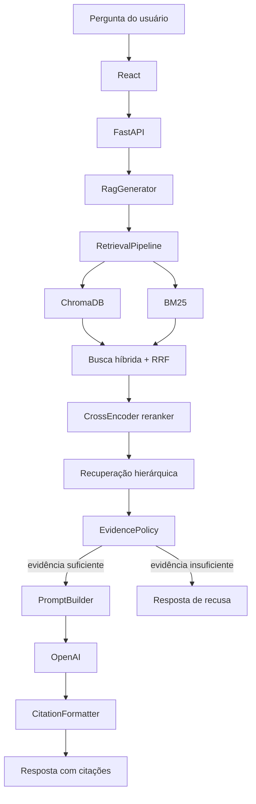

# FonteAliança / SolaBot

Assistente documental baseado em RAG para consulta a documentos doutrinários, confessionais e normativos da Aliança. O objetivo não é responder a partir do conhecimento geral do modelo, mas a partir de um corpus controlado, com recuperação rastreável, citações documentais e recusa quando a evidência recuperada não sustenta uma resposta.

## Aplicação Publicada

Deploy atual:

```txt
http://56.125.22.78:8000
```

O deploy atual roda em uma VM AWS EC2 com Docker. Se a instância for parada e não houver Elastic IP configurado, o IP público pode mudar quando ela for iniciada novamente.

## Escopo

O corpus ativo consolidado usa documentos doutrinários/confessionais e documentos normativos da Aliança. Os artefatos principais de runtime são:

- Chunks unificados: `corpus/processed/chunks/alliance/all_chunks_for_embeddings.jsonl`
- Índice ChromaDB: `corpus/indexes/chroma/alliance/`
- Collection ChromaDB: `solabot_alliance_v1`
- Pacote de runtime para Docker: `runtime_artifacts/solabot-runtime-corpus.tar.gz`

Documentos doutrinários/confessionais:

- Confissão de Fé de Westminster
- Cânones de Dort
- Catecismo de Heidelberg
- Confissão Batista de Londres de 1689
- Confissão de Fé Congregacional

Documentos normativos:

- Constituição da Aliança
- Regimento Interno
- Código de Ética do Ministro Congregacional
- Resolução nº 01/2020

Upload livre de documentos pelo usuário final não faz parte do escopo atual.

## Stack

| Camada | Tecnologia | Função |
| --- | --- | --- |
| Interface | React + Vite | Chat web e visualização das fontes |
| API | FastAPI + Uvicorn | Endpoints `/api/*` e frontend buildado |
| RAG | Python | Orquestra retrieval, evidência, prompt e geração |
| Vetorial | ChromaDB | Busca semântica por embeddings |
| Lexical | rank-bm25 | Busca por termos exatos |
| Reranking | sentence-transformers CrossEncoder | Reordenação neural dos candidatos |
| Modelo | OpenAI API | Embeddings de pergunta e resposta final |
| Observabilidade | LangSmith | Traces opcionais do fluxo RAG |
| Empacotamento | Docker | Imagem única com backend, frontend e corpus de runtime |

## Arquitetura



## Estrutura

```txt
sola-bot/
├── config/
├── corpus/
│   ├── raw/
│   ├── processed/
│   ├── indexes/
│   └── reports/
├── runtime_artifacts/
├── scripts/
│   ├── deployment/
│   └── pipeline/
├── src/
│   └── sola_bot/
│       ├── api/
│       ├── generation/
│       ├── retrieval/
│       └── observability.py
├── tests/
└── web/
```

## Ambiente

Crie um `.env` a partir do exemplo:

```bash
cp .env.example .env
```

No Windows PowerShell:

```powershell
Copy-Item .env.example .env
```

Variáveis essenciais:

```env
OPENAI_API_KEY=your_openai_api_key_here
OPENAI_CHAT_MODEL=gpt-5.4-mini

RAG_CORPUS_DIR=corpus
RAG_CHUNKS_PATH=corpus/processed/chunks/alliance/all_chunks_for_embeddings.jsonl
CHROMA_PERSIST_DIRECTORY=corpus/indexes/chroma/alliance
CHROMA_COLLECTION_NAME=solabot_alliance_v1

RERANKER_ENABLED=true
RERANKER_MODEL=cross-encoder/ms-marco-TinyBERT-L2-v2
RERANKER_UNLOAD_AFTER_REQUEST=true
RERANKED_TOP_K=12
HYBRID_CANDIDATE_K=16
RERANKER_MAX_TEXT_CHARS=1800
```

Não versione `.env` nem chaves reais.

## Como Rodar Localmente

### Opção 1: backend FastAPI + frontend Vite

Use este modo para desenvolvimento visual.

```bash
pip install -r requirements.txt
python scripts/run_web_chat.py
```

Em outro terminal:

```bash
cd web
npm install
npm run dev
```

Acesse:

```txt
http://127.0.0.1:5173
```

O Vite encaminha `/api/*` para `http://127.0.0.1:8000`.

### Opção 2: FastAPI servindo o frontend buildado

Use este modo para simular o deploy em uma única porta.

```bash
cd web
npm install
npm run build
cd ..
python scripts/run_web_chat.py
```

Acesse:

```txt
http://127.0.0.1:8000
```

Se estiver em um clone limpo e o índice Chroma não existir, extraia o pacote de runtime antes de iniciar:

```bash
tar -xzf runtime_artifacts/solabot-runtime-corpus.tar.gz
```

## Docker

Use Docker quando quiser executar a aplicação completa em um ambiente reproduzível. A imagem Docker:

- instala dependências Python e Node;
- builda o frontend;
- baixa o modelo leve do reranker durante o build;
- extrai `runtime_artifacts/solabot-runtime-corpus.tar.gz` para `/app/corpus`;
- expõe a aplicação em `:8000`.

Com Compose:

```bash
docker compose up -d --build
docker compose logs -f solabot
```

Acesse:

```txt
http://127.0.0.1:8000
```

Execução direta equivalente:

```bash
docker build -t solabot .
docker run -d --name solabot --restart unless-stopped --env-file .env -p 8000:8000 solabot
```

Para parar:

```bash
docker stop solabot
```

Para atualizar o corpus usado pela imagem:

```bash
python scripts/deployment/create_runtime_corpus_archive.py
docker compose up -d --build
```

## LangSmith

A integração é opcional. Para ativar traces:

```env
LANGSMITH_TRACING=true
LANGSMITH_ENDPOINT=https://api.smith.langchain.com
LANGSMITH_API_KEY=lsv2_sua_chave_aqui
LANGSMITH_PROJECT=solabot-local
```

No LangSmith, crie a chave em `Settings > API Keys`. Para uso local, um Personal Access Token é suficiente. Em um ambiente publicado como serviço, uma Service Key também é adequada.

Quando ativado, o projeto mostra traces como:

- `SolaBot RAG answer`
- `SolaBot retrieval`
- `SolaBot evidence policy`
- `SolaBot prompt builder`
- `SolaBot suggested questions`

## Reprocessamento do Corpus

Corpus reformado:

```bash
python scripts/pipeline/extract_reformed_corpus.py
python scripts/pipeline/normalize_reformed_corpus.py
python scripts/pipeline/chunk_reformed_corpus.py
```

Corpus normativo:

```bash
python scripts/pipeline/extract_normative_corpus.py
python scripts/pipeline/normalize_normative_corpus.py
python scripts/pipeline/chunk_normative_corpus.py
python scripts/pipeline/audit_normative_corpus.py
```

Embeddings e índice:

```bash
python scripts/pipeline/generate_openai_embeddings.py --resume
python scripts/pipeline/build_reformed_chroma_index.py --reset
```

Depois de alterar corpus, gere novamente o pacote de runtime:

```bash
python scripts/deployment/create_runtime_corpus_archive.py
```

## Endpoints

- `GET /api/health`
- `GET /api/documents`
- `POST /api/chat`
- `POST /api/suggestions`

## Testes

Testes principais:

```bash
python -m pytest tests/test_reranker_retriever.py tests/test_retrieval_pipeline.py
python -m pytest tests/test_rag_answer_generation.py tests/test_alliance_rag_integration.py
```

Build do frontend:

```bash
cd web
npm run build
```

Perguntas úteis para validação manual:

- "Do que se trata a justificação?"
- "O que é ser regenerado?"
- "O que é o batismo?"
- "Qual é o papel das Escrituras?"
- "Quais os deveres da igreja local?"
- "Como funciona o processo de ordenação?"
- "Quais são os deveres éticos do pastor?"

## Versionamento

As regras para arquivos locais, dependências, builds, logs e índices gerados ficam centralizadas no `.gitignore`.

O artefato `runtime_artifacts/solabot-runtime-corpus.tar.gz` é mantido no repositório para que a imagem Docker possa ser reconstruída com o corpus consolidado, sem depender de um disco persistente externo.
